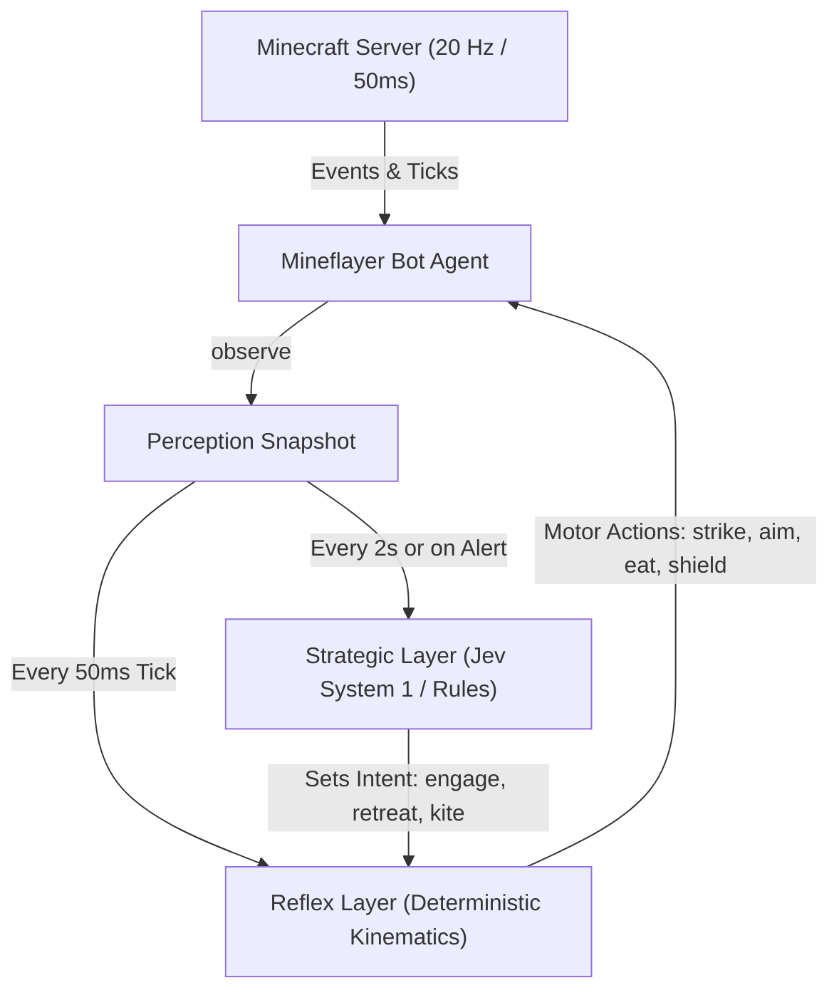
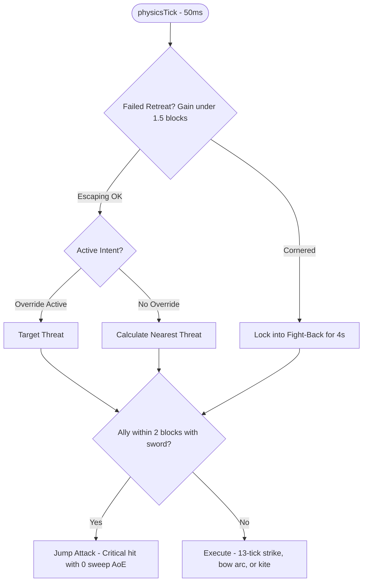
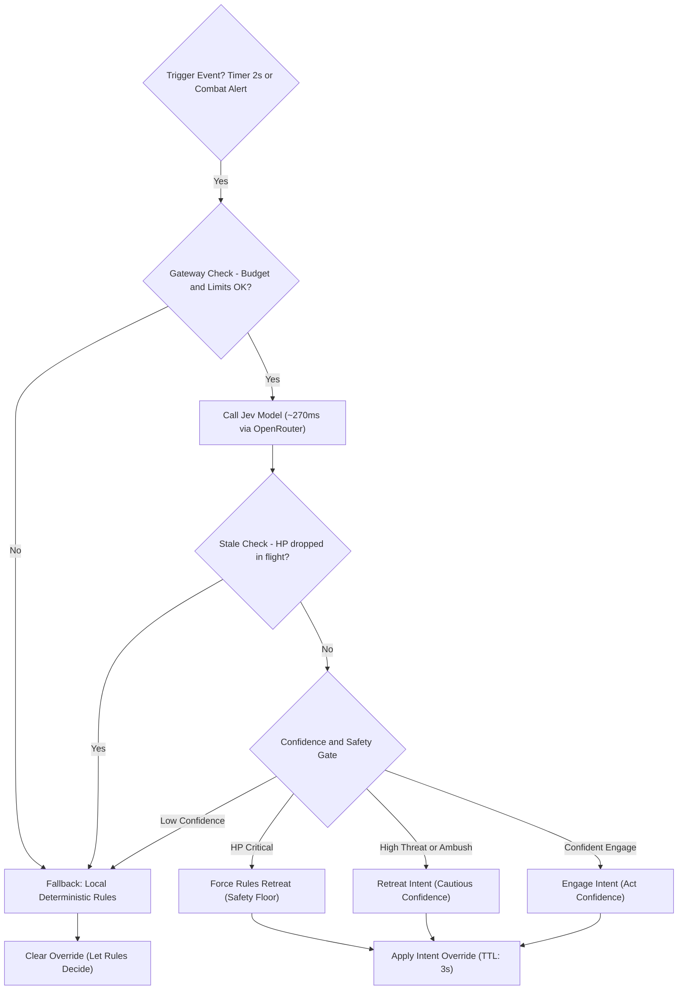
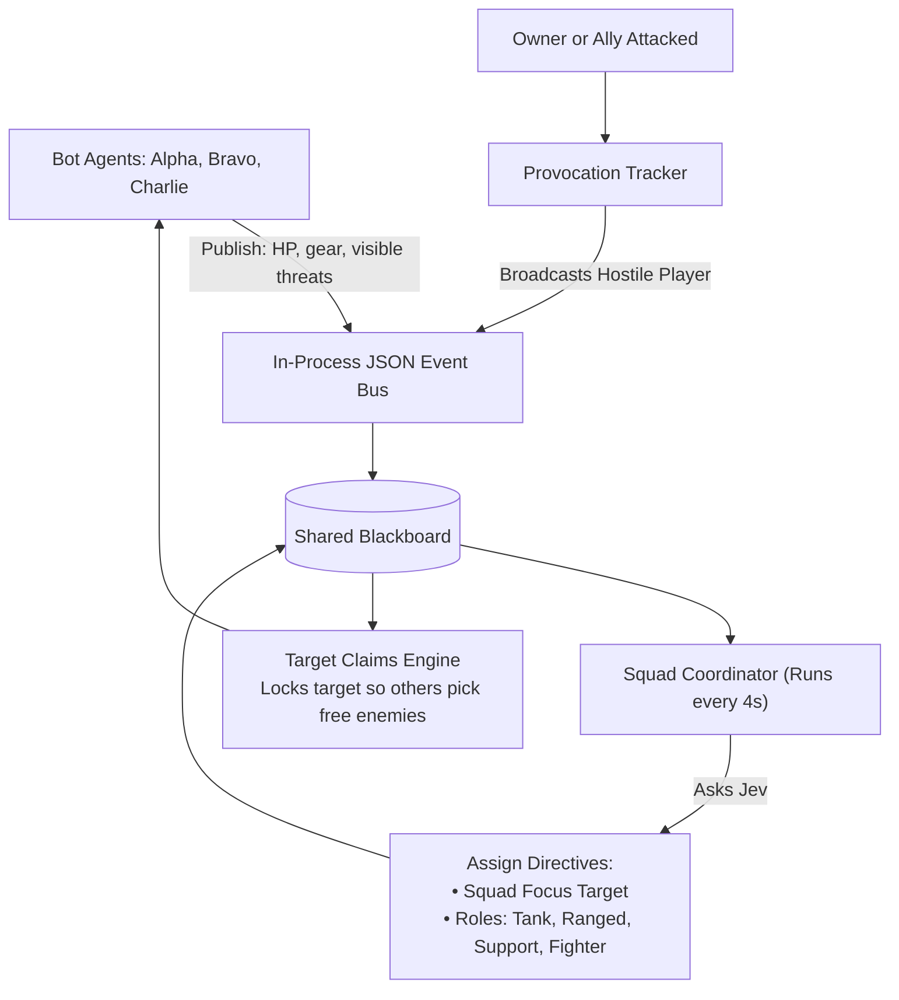

# Never Mine Alone Again: Building an AI Bodyguard Squad in Minecraft

### How dual-speed agent architecture, sub-penny typed AI, and multi-agent coordination turn dumb NPCs into elite tactical companions.

---

You know the feeling all too well.... 

You’re deep in an underground ravine at Y=-54. Your inventory is loaded with raw iron, redstone, and twelve precious diamonds. Your hunger bar is down two notches, your torches are running low, and suddenly—*tsst*. 

From the shadows behind you, a creeper is already flashing white. Two skeleton archers are rattling their bows on a ridge above, and a pack of zombies is shuffling through the water stream straight toward you. In vanilla Minecraft, this is usually the exact moment you lose your gear, smash your desk, and stare at the "Game Over!" screen.

Now, imagine an alternate reality. 

The moment that creeper hisses, an iron-clad bot named **Alpha** sprints forward, slices it with a sword, and immediately backpedals 7.5 blocks outside the blast radius before the fuse blows. Behind you, **Bravo** whips out a bow, solves a ballistic trajectory equation accounting for drag and gravity, and snipes the skeleton off the ledge. Meanwhile, **Charlie** steps in front of you with a shield, absorbing zombie hits and drawing aggro away from your low-health flank. 

And when Alpha fights next to you in tight corridors? It intentionally leaps into the air for vertical critical hits—because on-the-ground sweeps would deal collateral friendly-fire damage to *you*.

This isn't a team of try-hard human teammates. It’s an autonomous, intelligent squad running on [**mc-jev**](https://github.com/balamuru/mc-jev) — an open-source project combining deterministic fast-twitch code with **Jev**, TypeSafe’s ultra-fast typed-decision model.

Here’s the story of why traditional AI agents fail miserably in real-time gaming, and how a dual-speed cognitive architecture makes AI companions finally work.

---

## The Catch-22 of Game AI: Why Standard LLMs Die in 50ms

Over the last two years, we’ve seen countless demos of "AI agents playing Minecraft." Almost all of them follow the classic LLM prompt-and-parse pattern: 

1. Capture game state.
2. Build an enormous text prompt.
3. Call GPT-4 or Claude via API.
4. Parse the generated JSON into bot actions.

It sounds great in theory. In an active survival world, it is an absolute disaster.

Minecraft’s physics engine ticks at a relentless **20 Hz** — exactly once every **50 milliseconds**. In that tiny slice of time, arrow trajectories advance, creepers count down their fuses, and attack cooldowns recharge.

```
┌────────────────────────────────────────────────────────┐
│ The Real-Time Gaming Dilemma                           │
│                                                        │
│ Game Tick (50ms)  ████                                 │
│ LLM Call (1500ms) ████████████████████████████████████ │
└────────────────────────────────────────────────────────┘
```

When your AI takes 1.5 to 3 seconds to "think," your bot isn't an intelligent teammate; it's a glorified mannequin waiting to be slaughtered. If you prompt an LLM to control individual motor actions ("move forward 1.2 blocks, swing sword, turn 14 degrees"), it hallucinates coordinates, trips over cobblestone, and costs $20 an hour in tokens.

To augment a human player in real time, you cannot use an LLM as a motor cortex. **You need a dual-speed brain.**

---

## Enter the Dual-Speed Architecture: Reflexes vs. Strategy

The architectural breakthrough in [mc-jev](https://github.com/balamuru/mc-jev) mirrors biological evolution: separate the **fast autonomic nervous system** from the **slower cerebral cortex**.



### 1. The 50ms Reflex Layer (Pure Deterministic Code)
The reflex layer runs locally on every single `physicsTick`. It **never** waits on network I/O. Its job is purely mechanical execution:
* **The 13-Tick Rhythm:** In modern Minecraft combat, button-mashing is penalized; weapons deal maximum damage only when fully charged (13 ticks for swords). The reflex layer times every swing to the tick.
* **Arrow Ballistics Simulator:** Arrows in Minecraft aren't laser beams—they obey gravitational acceleration (0.05 blocks/tick²) and air resistance (0.99 drag). The reflex layer solves the launch pitch angle and leads moving targets by measuring their velocity vectors.
* **Friendly Sweep Prevention:** In Java Edition, swinging a sword on the ground emits a wide slashing sweep attack that damages everything nearby—including you, the owner. When the bot detects you standing within 2 blocks of its target, it automatically jump-attacks. Mid-air swings trigger critical hits with **zero** horizontal sweep!
* **The Creeper Waltz:** Swing once, immediately kite backward past 7.5 blocks while the weapon recharges, and step back in. No blown-up terrain, no lost hearts.



### 2. The Strategic Layer (Jev & TypeSafe System 1 AI)
If the reflex layer provides the muscles, what tells the bot *what* to do? 

That's where **Jev** comes in. Sitting above the reflex loop, Jev evaluates the bigger tactical picture every couple of seconds (or instantaneously when an alarm triggers, like taking sudden damage or detecting low HP).

Instead of parsing ambiguous conversational prompts, Jev is a **System 1 typed judgment model**. We feed it a lightweight JSON representation (~700 tokens) of the bot’s gear, health, and visible threats, and ask multiple typed questions in a single request:

```typescript
// Compact, typed strategic questions evaluated in parallel
{
  tactic: 'engage' | 'retreat' | 'ignore',
  target: 't1' | 't2' | 'none',
  threat_level: score(0..3),      // 0: trivial, 3: deadly
  ambush: probability(0..1.0),    // flanking / encirclement risk
  player_hostile: probability()   // is that stranger about to attack?
}
```

Jev evaluates all questions in parallel in **~270 milliseconds**, costing an astonishing **$0.00003 per call** ($0.042 per million input tokens, with free output tokens). For less than a nickel an hour of intense combat, your bot has continuous high-level tactical awareness.



---

## Multi-Agent Squads: Why Blackboard over LangGraph?

A single companion is cool. A synchronized tactical squad is game-changing. But building a multi-agent system in a real-time game raises an immediate question:

### Do we use LangGraph in this project?
**No. LangGraph is deliberately not used in mc-jev.**

Developers familiar with multi-agent orchestration naturally wonder if frameworks like LangGraph or LangChain fit here. While LangGraph is powerful for complex, turn-based workflows (like document analysis, coding assistants, or multi-step research agents), it suffers from a fundamental impedance mismatch when applied to real-time gaming:

| Dimension | LangGraph / Turn-Based Frameworks | The mc-jev Architecture |
| :--- | :--- | :--- |
| **Control Clock** | Turn-based / Request-driven | **20 Hz (50ms) hard game physics tick** |
| **Latency Budget** | Seconds (waiting on LLM node resolution) | **0ms local execution**, async 270ms strategic inference |
| **Model Type** | General LLMs (GPT-4, Claude) with tool calls | **Fast typed System 1 models (Jev)** |
| **State Structure** | Graph state with message histories & checkpoints | **Ephemeral perception snapshots & JSON event bus** |
| **Failure Mode** | Graph pauses, retries, or bubbles exceptions | **Seamless instant fallback to deterministic rules** |
| **Cost Profile** | $0.01 - $0.10+ per agent interaction | **$0.00003 per strategic evaluation** |

If an agent in a LangGraph graph waits 2 seconds for a graph edge to transition or an LLM tool to parse, your Minecraft bot has already drowned in lava or been blown up by a creeper.

### The Real-Time Solution: In-Process Event Bus & Blackboard
Instead of heavy agent graphs, [mc-jev](https://github.com/balamuru/mc-jev) implements a lightweight, zero-dependency **Blackboard Architecture** inspired by autonomous robotics:



1. **The Blackboard & Target Claims:**
   Bots broadcast JSON events (`heartbeat`, `threats`, `claim`, `damaged`, `provoked`) over an in-process bus. When Bot A attacks a zombie, it claims that target with an 8-second TTL. Other bots inspect the blackboard, see the claim, and immediately select unallocated threats.
2. **Dynamic Combat Roles:**
   Every 4 seconds, a lightweight coordinator queries Jev to assess squad health and assign roles:
   * **The Tank:** Pinpoints the teammate with the lowest HP and intercepts threats bearing down on them.
   * **The Ranged Sniper:** Holds distance at 12 blocks, prioritizing creepers and archers.
   * **The Support:** Rushes to hurt allies before engaging solo threats.
   * **The Fighter:** High-mobility frontliner dealing raw melee damage.
3. **Player Bodyguarding:**
   When an unknown player attacks you, the `ProvocationTracker` fires a `provoked` event across the bus, triggering an immediate, unified counterattack by the entire squad.

---

## The Golden Rules for Real-Time AI Companions

Building [mc-jev](https://github.com/balamuru/mc-jev) revealed a set of principles that apply to anyone designing real-time AI agents, whether for gaming, robotics, or interactive simulations:

1. **Keep the Execution Loop Offline:** Never let a network request block your physics tick. If the API lags or goes down, your reflex code should seamlessly keep fighting.
2. **Use AI for Intent, Code for Kinematics:** Let deterministic code handle pathfinding, aiming, and weapon cooldowns. Use AI models to judge danger, allocate roles, and choose strategies.
3. **Enforce Asymmetric Confidence Gates:** Allow AI to add caution easily (e.g. retreating when an ambush is detected), but demand high confidence before overruling baseline safety rules.
4. **Economics Matter:** Real-time software cannot burn $0.05 every second on massive multimodal models. Purpose-built, typed System 1 models like Jev provide the programmable common sense you need at fraction-of-a-cent operational costs.

---

## Try It Yourself

Want an intelligent squad watching your back on your next Minecraft adventure?

The entire project is open-source, fully typed in TypeScript, and ready to run against local Paper servers or live multiplayer worlds:

👉 **GitHub Repository:** [https://github.com/balamuru/mc-jev](https://github.com/balamuru/mc-jev)

Clone the repo, spin up your bots, and experience what it feels like to never have to mine alone again.
