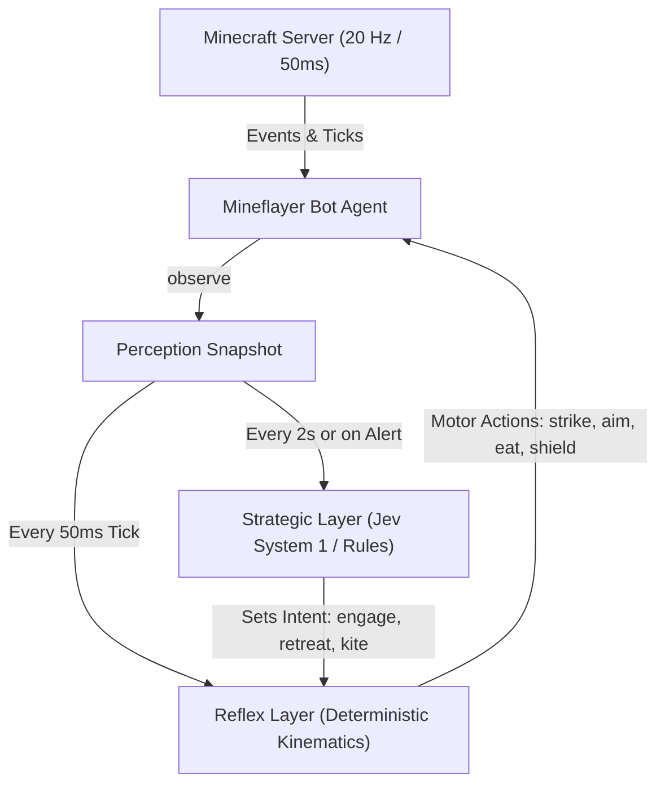
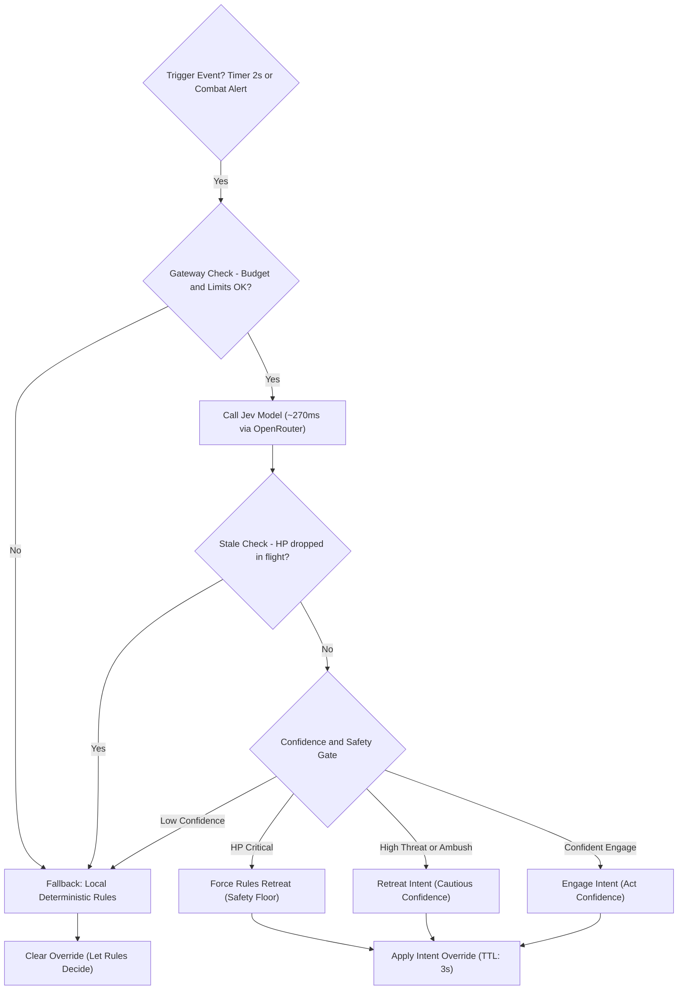
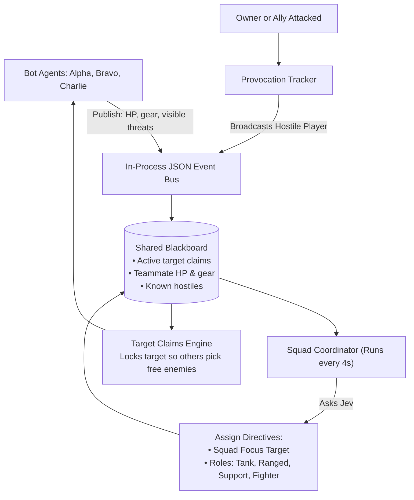

# Never Mine Alone Again: Building an AI Bodyguard Squad in Minecraft

### How dual-speed agent architecture, sub-penny typed AI, and multi-agent coordination turn dumb NPCs into elite tactical companions.

---

You know the feeling all too well.... 

You’re deep in an underground ravine at Y=-54. Your inventory is loaded with raw iron, redstone, and twelve precious diamonds. Your hunger bar is down two notches, your torches are running low, and suddenly—*tsst*. 

From the shadows behind you, a creeper is already flashing white. Two skeleton archers are rattling their bows on a ridge above, and a pack of zombies is shuffling through the water stream straight toward you. In vanilla Minecraft, this is usually the exact moment you lose your gear, smash your desk, and stare at the "Game Over!" screen.

Now, imagine an alternate reality. 

The moment that creeper hisses, an iron-clad bot named **Alpha** sprints forward, slices it with a sword, and immediately backpedals 7.5 blocks outside the blast radius before the fuse blows. Behind you, **Bravo** whips out a bow, solves a ballistic trajectory equation accounting for drag and gravity, and snipes the skeleton off the ledge. Meanwhile, **Charlie** steps in front of you with a shield, absorbing zombie hits and drawing aggro away from your low-health flank. 

And when Alpha fights next to you in tight corridors? It intentionally leaps into the air for vertical critical hits—because on-the-ground sweeps would deal collateral friendly-fire damage to *you*.

This isn't a team of try-hard human teammates. It’s an autonomous, intelligent squad running on [**mc-jev**](https://github.com/balamuru/mc-jev) — an open-source project combining deterministic fast-twitch code with **Jev**, TypeSafe’s ultra-fast typed-decision model.

Here’s the story of why traditional AI agents fail miserably in real-time gaming, and how a dual-speed cognitive architecture makes AI companions finally work.

---

## The Catch-22 of Game AI: Why Standard LLMs Die in 50ms

Over the last two years, we’ve seen countless demos of "AI agents playing Minecraft." Almost all of them follow the classic LLM prompt-and-parse pattern: 

1. Capture game state.
2. Build an enormous text prompt.
3. Call GPT-4 or Claude via API.
4. Parse the generated JSON into bot actions.

It sounds great in theory. In an active survival world, it is an absolute disaster.

Minecraft’s physics engine ticks at a relentless **20 Hz** — exactly once every **50 milliseconds**. In that tiny slice of time, arrow trajectories advance, creepers count down their fuses, and attack cooldowns recharge.

```
┌────────────────────────────────────────────────────────┐
│ The Real-Time Gaming Dilemma                           │
│                                                        │
│ Game Tick (50ms)  ████                                 │
│ LLM Call (1500ms) ████████████████████████████████████ │
└────────────────────────────────────────────────────────┘
```

When your AI takes 1.5 to 3 seconds to "think," your bot isn't an intelligent teammate; it's a glorified mannequin waiting to be slaughtered. If you prompt an LLM to control individual motor actions ("move forward 1.2 blocks, swing sword, turn 14 degrees"), it hallucinates coordinates, trips over cobblestone, and costs $20 an hour in tokens.

To augment a human player in real time, you cannot use an LLM as a motor cortex. **You need a dual-speed brain.**

---

## Enter the Dual-Speed Architecture: Reflexes vs. Strategy

The architectural breakthrough in [mc-jev](https://github.com/balamuru/mc-jev) mirrors biological evolution: separate the **fast autonomic nervous system** from the **slower cerebral cortex**.



### 1. The 50ms Reflex Layer (Pure Deterministic Code)
The reflex layer runs locally on every single `physicsTick`. It **never** waits on network I/O. Its job is purely mechanical execution:
* **The 13-Tick Rhythm:** In modern Minecraft combat, button-mashing is penalized; weapons deal maximum damage only when fully charged (13 ticks for swords). The reflex layer times every swing to the tick.
* **Arrow Ballistics Simulator:** Arrows in Minecraft aren't laser beams—they obey gravitational acceleration (0.05 blocks/tick²) and air resistance (0.99 drag). The reflex layer solves the launch pitch angle and leads moving targets by measuring their velocity vectors.
* **Friendly Sweep Prevention:** In Java Edition, swinging a sword on the ground emits a wide slashing sweep attack that damages everything nearby—including you, the owner. When the bot detects you standing within 2 blocks of its target, it automatically jump-attacks. Mid-air swings trigger critical hits with **zero** horizontal sweep!
* **The Creeper Waltz:** Swing once, immediately kite backward past 7.5 blocks while the weapon recharges, and step back in. No blown-up terrain, no lost hearts.


### 2. The Strategic Layer (Jev & TypeSafe System 1 AI)
If the reflex layer provides the muscles, what tells the bot *what* to do? 

That's where **Jev** comes in. Sitting above the reflex loop, Jev evaluates the bigger tactical picture every couple of seconds (or instantaneously when an alarm triggers, like taking sudden damage or detecting low HP).

Instead of parsing ambiguous conversational prompts, Jev is a **System 1 typed judgment model**. We feed it a lightweight JSON representation (~700 tokens) of the bot’s gear, health, and visible threats, and ask multiple typed questions in a single request:

```typescript
// Compact, typed strategic questions evaluated in parallel
{
  tactic: 'engage' | 'retreat' | 'ignore',
  target: 't1' | 't2' | 'none',
  threat_level: score(0..3),      // 0: trivial, 3: deadly
  ambush: probability(0..1.0),    // flanking / encirclement risk
  player_hostile: probability()   // is that stranger about to attack?
}
```

Jev evaluates all questions in parallel in **~270 milliseconds**, costing an astonishing **$0.00003 per call** ($0.042 per million input tokens, with free output tokens). For less than a nickel an hour of intense combat, your bot has continuous high-level tactical awareness.



---

## Multi-Agent Squads: Classic Blackboard Architecture & The LangGraph Roadmap

A single companion is cool. A synchronized tactical squad is game-changing. 

To coordinate multiple bots without dogpiling the same zombie or shooting each other, [mc-jev](https://github.com/balamuru/mc-jev) uses a **Blackboard Architecture**. 

### What is "Blackboard Architecture"? Is it special to Jev?
Not at all. **Blackboard Architecture is one of the classical, foundational design patterns in artificial intelligence**, first formulated in 1975 for the **Hearsay-II** speech-understanding system at Carnegie Mellon University.

The metaphor is intuitive: imagine a group of human specialists standing around a physical blackboard. 
1. None of the specialists talk to each other directly.
2. When a specialist makes an observation or deduces a fact, they write it on the board.
3. Other specialists watch the board, react to new information, and write their own updates.

For fifty years, this pattern has powered autonomous robotics, submarine sonar tracking, aerospace systems, and game AI because it completely decouples agents:



In `mc-jev`:
1. **Target Claims:** When Bot A engages a zombie, it writes a `claim` to the blackboard with an 8-second TTL. Bots B and C see the claim on the board and immediately target other hostiles.
2. **Dynamic Combat Roles:** Every 4 seconds, the squad coordinator assesses the board and prompts Jev to assign roles (`tank`, `ranged`, `support`, `fighter`) tailored to the encounter.
3. **Player Bodyguarding:** When a hostile player attacks the owner, a `provoked` event floods the board, mobilizing the entire squad in unified retaliation.

---

## The LangGraph Roadmap: How to Model This in a Graph

Could you implement this exact same architecture with **LangGraph**? 

**Yes, absolutely.** In fact, LangGraph and Jev are natural partners. Jev provides fast, typed, sub-penny System 1 model inference ($0.042/1M input tokens), while LangGraph provides declarative state machines, conditional routing, and observability.

Here is the blueprint for how `mc-jev` can be implemented with LangGraph:

### 1. The Strategic Layer as a LangGraph `StateGraph`
Because LangGraph nodes are standard async functions, a node can call `@typesafe-ai/sdk` just like any other API. The strategic decision pipeline maps cleanly to a compiled graph:

```typescript
import { StateGraph, Annotation, END, START } from "@langchain/langgraph";
import { createJevClient } from "./strategic/jev.js";
import { decideWithJev } from "./strategic/policy.js";
import { decideByRules } from "./reflex/rules.js";

// Define graph state
const StrategicState = Annotation.Root({
  snapshot: Annotation<Snapshot>(),
  isGatewayOk: Annotation<boolean>(),
  judgment: Annotation<Judgment | null>(),
  isStale: Annotation<boolean>(),
  finalIntent: Annotation<Intent>(),
});

// Build the workflow
export const strategicWorkflow = new StateGraph(StrategicState)
  .addNode("checkGateway", async (state) => ({ 
    isGatewayOk: gateway.allowCall() 
  }))
  .addNode("callJev", async (state) => {
    const res = await jevClient.ask(buildQuestions(state.snapshot));
    return { judgment: parseJudgment(res) };
  })
  .addNode("checkStaleness", async (state) => ({
    isStale: (state.snapshot.self.hp - getCurrentHp()) >= 5
  }))
  .addNode("policyGate", async (state) => ({
    finalIntent: decideWithJev(state.judgment!, decideByRules(state.snapshot), state.snapshot).intent
  }))
  .addNode("fallbackRules", async (state) => ({
    finalIntent: decideByRules(state.snapshot)
  }))
  
  // Routing edges
  .addEdge(START, "checkGateway")
  .addConditionalEdges("checkGateway", (s) => s.isGatewayOk ? "callJev" : "fallbackRules")
  .addEdge("callJev", "checkStaleness")
  .addConditionalEdges("checkStaleness", (s) => s.isStale ? "fallbackRules" : "policyGate")
  .addEdge("policyGate", END)
  .addEdge("fallbackRules", END)
  .compile();
```

### 2. The 3-Step Implementation Roadmap

* **Phase 1: Out-of-Band StateGraph Execution**
  Run the compiled `strategicWorkflow` out-of-band in the background on alert triggers (`hurt`, `lowHp`, `newThreat`) or periodic timers. The 50ms reflex loop remains purely local and non-blocking, reading the latest `finalIntent` output emitted by the graph.
* **Phase 2: Hierarchical Multi-Agent Graph (Squad Supervisor)**
  Replace the in-process blackboard with a LangGraph multi-agent supervisor graph. A central `CoordinatorNode` processes the combined squad state and routes directives down to individual bot subgraphs.
* **Phase 3: Visual Observability & Replay via LangSmith**
  By running through LangGraph, every Jev call, snapshot input, confidence gate branch, and token cost is automatically traced in LangSmith. Developers can visually inspect why a bot chose to retreat, replay historical combat encounters, and benchmark question prompts with zero custom telemetry code.

---

## The Golden Rules for Real-Time AI Companions

Building [mc-jev](https://github.com/balamuru/mc-jev) revealed a set of principles that apply to anyone designing real-time AI agents, whether for gaming, robotics, or interactive simulations:

1. **Keep the Execution Loop Offline:** Never let a network request block your physics tick. If the API lags or goes down, your reflex code should seamlessly keep fighting.
2. **Use AI for Intent, Code for Kinematics:** Let deterministic code handle pathfinding, aiming, and weapon cooldowns. Use AI models to judge danger, allocate roles, and choose strategies.
3. **Enforce Asymmetric Confidence Gates:** Allow AI to add caution easily (e.g. retreating when an ambush is detected), but demand high confidence before overruling baseline safety rules.
4. **Economics Matter:** Real-time software cannot burn $0.05 every second on massive multimodal models. Purpose-built, typed System 1 models like Jev provide the programmable common sense you need at fraction-of-a-cent operational costs.

---

## Try It Yourself

Want an intelligent squad watching your back on your next Minecraft adventure?

The entire project is open-source, fully typed in TypeScript, and ready to run against local Paper servers or live multiplayer worlds:

👉 **GitHub Repository:** [https://github.com/balamuru/mc-jev](https://github.com/balamuru/mc-jev)

Clone the repo, spin up your bots, and experience what it feels like to never have to mine alone again.
